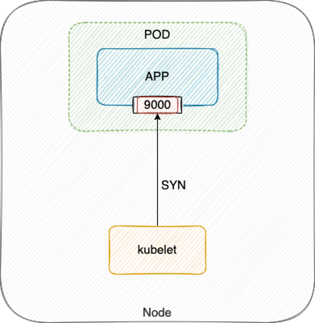
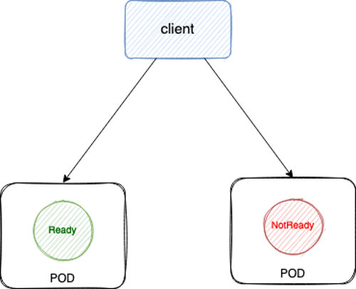

# 健康检查配置

> 本文视频教程: [https://www.bilibili.com/video/BV16q4y1y7B9](https://www.bilibili.com/video/BV16q4y1y7B9)

本文分享 K8S 健康检查配置的最佳实践，文末也分享配置不当的案例。

## Kubernetes 健康检查介绍

K8S 支持三种健康检查：
1. 就绪检查(`readinessProbe`): Pod启动后，如果配了就绪检查，要等就绪检查探测成功，Pod Ready 状态变为 True，允许放流量进来；在运行期间如果突然探测失败，Ready 状态变为 False，摘除流量。
2. 存活检查(`livenessProbe`): Pod 在运行时，如果存活检查探测失败，会自动重启容器；值得注意的是，存活探测的结果不影响 Pod 的 Ready 状态，这也是许多同学可能误解的地方。
3. 启动检查(`startupProbe`): 作用是让存活检查和就绪检查的开始探测时间延后，等启动检查成功后再开始探测，通常用于避免业务进程启动慢导致存活检查失败而被无限重启。

三种健康检查配置格式都是一样的，以 `readinessProbe` 为例:

```yaml
readinessProbe:
  successThreshold: 1 # 1 次探测成功就认为健康
  failureThreshold: 2 # 连续 2 次探测失败认为不健康
  periodSeconds: 3 # 3s 探测一次
  timeoutSeconds: 2 # 2s 超时还没返回成功就认为不健康
  httpGet: # 使用 http 接口方式探测，GET 请求 80 端口的 "/healthz" 这个 http 接口，响应状态码在200~399之间视为健康，否则不健康。
    port: 80
    path: "/healthz"
  #exec: # 使用脚本探测，执行容器内 "/check-health.sh" 这个脚本文件，退出状态码等于0视为健康，否则不健康。
  #  command: ["/check-health.sh"]
  #tcp: # 使用 TCP 探测，看 9000 端口是否监听。
  #  port: 9000
```

## 探测结果一定要真实反应业务健康状态

### 首选 HTTP 探测

通常是推荐业务自身提供 http 探测接口，如果业务层面健康就返回 200 状态码；否则，就返回 500。

### 备选脚本探测

如果业务还不支持 http 探测接口，或者有探测接口但不是 http 协议，也可以将探测逻辑写到脚本文件里，然后配置脚本方式探测。

### 尽量避免 TCP 探测

另外，应尽量避免使用 TCP 探测，因为 TCP 探测实际就是 kubelet 向指定端口发送 TCP SYN 握手包，当端口被监听内核就会直接响应 ACK，探测就会成功:



当程序死锁或 hang 死，这些并不影响端口监听，所以探测结果还是健康，流量打到表面健康但实际不健康的 Pod 上，就无法处理请求，从而引发业务故障。

## 所有提供服务的 container 都要加上 ReadinessProbe

如果你的容器对外提供了服务，监听了端口，那么都应该配上 ReadinessProbe，ReadinessProbe 不通过就视为 Pod 不健康，然后会自动将不健康的 Pod 踢出去，避免将业务流量转发给异常 Pod。



## 谨慎使用 LivenessProbe

LivenessProbe 失败会重启 Pod，不要轻易使用，除非你了解后果并且明白为什么你需要它，参考 [Liveness Probes are Dangerous](https://srcco.de/posts/kubernetes-liveness-probes-are-dangerous.html) 。

### 探测条件要更宽松

如果使用 LivenessProbe，不要和 ReadinessProbe 设置成一样，需要更宽松一点，避免因抖动导致 Pod 频繁被重启。

通常是失败阈值 (`failureThreshold`) 设置得更大一点，避免因探测太敏感导致 Pod 很容易被重启。

另外如果有必要，超时时间 (`timeoutSeconds`) 和探测间隔 (`periodSeconds`) 也可以根据情况适当延长。

### 保护慢启动容器

有些应用本身可能启动慢(比如 Java)，或者用的富容器，需要起一大堆依赖，导致容器启动需要的较长，如果配置了存活检查，可能会造成启动过程中达到失败阈值被重启，如此循环，无限重启。

对于这类启动慢的容器，我们需要保护下，等待应用完全启动后才开始探测:

1. 如果 K8S 版本低于 1.18，可以设置 LivenessProbe 的初始探测延时 (`initialDelaySeconds`)。
2. 如果 K8S 版本在 1.18 及其以上，可以配置 [StartProbe](https://kubernetes.io/docs/tasks/configure-pod-container/configure-liveness-readiness-startup-probes/#define-startup-probes)，保证等应用完全启动后才开始探测。

### 避免依赖导致级联故障

LivenessProbe 探测逻辑里不要有外部依赖 (db, 其它 pod 等)，避免抖动导致级联故障。


如上图，Pod B 探测逻辑里查 DB，Pod A 探测逻辑里调用 Pod B，如果 DB 抖动，Pod B 变为不健康，Pod A 调用 Pod B 也失败，也变为不健康，从而级联故障。

## 一个配置不合理引发的血案

故障现象: Pod 突然不断重启，期间有流量进入，这部分流量异常。

原因：
1. Pod 之前所在节点异常，重建漂移到了其它节点去启动。
2. Pod 重建后由于基础镜像中依赖的一个服务有问题导致启动较慢，因为同时配置了 ReadinessProbe 与 LivenessProbe，大概率是启动时所有健康检查都失败，达到 LivenessProbe 失败次数阈值，又被重启。
3. Pod 配置了 preStop 实现优雅终止，被重启前会先执行 preStop，优雅终止的时长较长，preStop 期间 ReadinessProbe 还会继续探测。
4. 探测方式使用的 TCP 探测，进程优雅终止过程中 TCP 探测仍然会成功(没完全退出前端口监听仍然存在)，但实际此时进程已不会处理新请求了。
5. LivenessProbe 结果不会影响 Pod Ready 状态，是否 Ready 主要取决于 ReadinessProbe 结果，由于 preStop 期间 ReadinessProbe 是成功的，Pod 就变 Ready 了。
6. Pod Ready 但实际无法处理请求，业务就会异常。

总结:
1. Pod 慢启动 + 存活探测 导致被无限重启。需要延长 `initialDelaySeconds` 或 [StartProbe](https://kubernetes.io/docs/tasks/configure-pod-container/configure-liveness-readiness-startup-probes/#define-startup-probes) 来保护慢启动容器。
2. TCP 探测方式不能完全真实反应业务健康状态，导致在优雅终止过程中，ReadinessProbe 探测成功让流量放进来而业务却不会处理，导致流量异常。需要使用更好的探测方式，建议业务提供 HTTP 探活接口，使用 HTTP 探测业务真实健康状态。