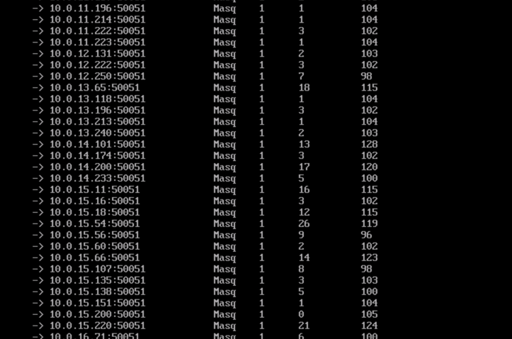
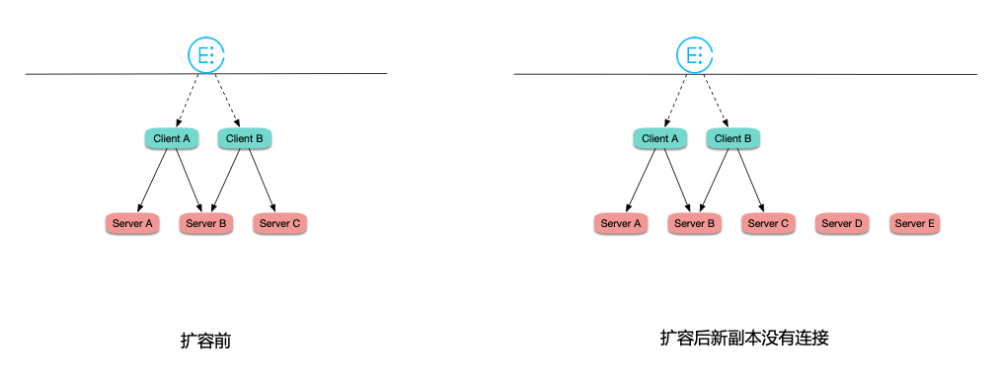

# 长连接服务

## 负载不均问题

对于长连接的服务，可能会存在负载不均的问题，下面介绍两种场景。

### 滚动更新负载不均

在连接数比较固定或波动不大的情况下，滚动更新时，旧 Pod 上的连接逐渐断掉，重连到新启动的 Pod 上，越先启动的 Pod 所接收到的连接数越多，造成负载不均:

### rr 策略负载不均

假如长连接服务的不同连接的保持时长差异很大，而 ipvs 转发时默认是 rr 策略转发，如果某些后端 Pod "运气较差"，它们上面的连接保持时间比较较长，而由于是 rr 转发，它们身上累计的连接数就可能较多，节点上通过 `ipvsadm -Ln -t CLUSTER-IP:PORT` 查看某个 service 的转发情况:

部分 Pod 连接数高，意味着相比连接数低的 Pod 要同时处理更多的连接，着消耗的资源也就相对更多，从而造成负载不均。

将 kube-proxy 的 ipvs 转发模式设置为 lc (Least-Connection) ，即倾向转发给连接数少的 Pod，可能会有所缓解，但也不一定，因为 ipvs 的负载均衡状态是分散在各个节点的，并没有收敛到一个地方，也就无法在全局层面感知哪个 Pod 上的连接数少，并不能真正做到 lc。

## 扩容失效问题

在连接数比较固定或波动不大的情况下，工作负载在 HPA 自动扩容时，由于是场链接，连接数又比较固定，所有连接都 "固化" 在之前的 Pod 上，新扩出的 Pod 几乎没有连接，造成之前的 Pod 高负载，而扩出来的 Pod 又无法分担压力，导致扩容失效:

## 最佳实践

1. 业务层面自动重连，避免连接 "固化" 到某个后端 Pod 上。比如周期性定时重连，或者一个连接中处理的请求数达到阈值后自动重连。
2. 不直接请求后端，通过七层代理访问。比如 gRPC 协议，可以 [使用 nginx ingress 转发 gRPC](https://kubernetes.github.io/ingress-nginx/examples/grpc/)，也可以 [使用 istio 转发 gRPC](https://istiobyexample.dev/grpc/)，这样对于 gRPC 这样多个请求复用同一个长连接的场景，经过七层代理后，可以自动拆分请求，在请求级别负载均衡。