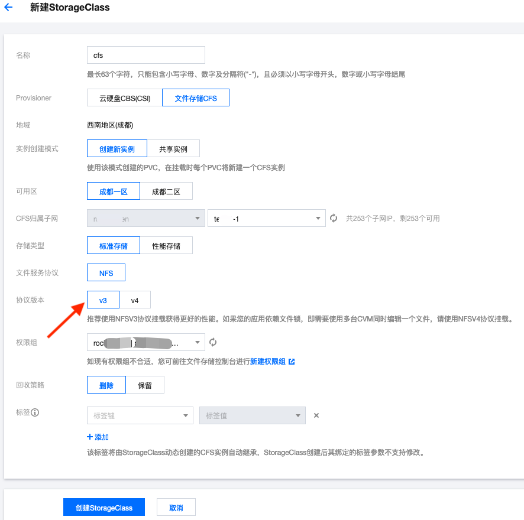

# 使用 V3 协议挂载 CFS

## 背景

腾讯云 CFS 文件存储，同时支持 NFS V3 和 V4 协议，mount 的时候，如果不指定协议，默认是客户端与服务端协商得到版本号，大多情况下会使用 NFS V4 协议，但 CFS 文件存储使用 NFS V4 挂载的话目前存在不稳定的问题，建议是显式指定使用 NFS V3 协议挂载。

本文分别介绍在腾讯云容器服务 TKE 和 EKS 两种集群中，显式指定使用 NFS V3 协议挂载的方法。

## 使用 CFS 插件 (仅限 TKE 集群)

### StorageClass 自动创建 CFS

如果 TKE 集群安装了 CFS 扩展组件，可以自动创建并挂载 CFS 存储，创建 StorageClass 时协议版本选择 V3:



yaml 示例:

```yaml
apiVersion: storage.k8s.io/v1
kind: StorageClass
metadata:
  name: cfs
parameters:
  vers: "3" # 关键点：指定协议版本。
  pgroupid: pgroup-mni3ng8n # 指定自动创建出来的 CFS 的权限组 ID。
  storagetype: SD # 指定自动创建出来的 CFS 的存储类型。SD 为标准存储，HP 为性能存储。
  subdir-share: "true" # 是否每个 PVC 都共享同一个 CFS 实例。
  vpcid: vpc-e8wtynjo # 指定 VPC ID，确保与当前集群 VPC 相同。
  subnetid: subnet-e7uo51yj # 指定自动创建出来的 CFS 的子网 ID。
provisioner: com.tencent.cloud.csi.tcfs.cfs
reclaimPolicy: Delete
volumeBindingMode: Immediate
```

后续使用 PVC 直接指定前面创建的 StorageClass 即可。

### 静态创建复用已有 CFS 实例

如果已经有 CFS 实例了，希望不自动创建而直接复用已有 CFS 实例，可以使用静态创建。

yaml 实例:

```yaml
apiVersion: v1
kind: PersistentVolume
metadata:
  name: cfs-pv
spec:
  accessModes:
  - ReadWriteMany
  capacity:
    storage: 10Gi
  csi:
    driver: com.tencent.cloud.csi.cfs
    volumeAttributes:
      fsid: yemafcez # 指定 fsid，在 CFS 实例控制台页面的挂载点信息里看 NFS 3.0 挂载命令，里面有 fsid。
      host: 10.10.9.6 # CFS 实例 IP。
      path: / # 指定要挂载的 CFS 实例的目录。
      vers: "3" # 关键点：指定协议版本。
    volumeHandle: cfs-pv
  persistentVolumeReclaimPolicy: Retain
  storageClassName: "" # 指定 StorageClass 为空
  volumeMode: Filesystem
---
apiVersion: v1
kind: PersistentVolumeClaim
metadata:
  name: cfs-pvc
spec:
  accessModes:
  - ReadWriteMany
  resources:
    requests:
      storage: 10Gi
  storageClassName: "" # 指定 StorageClass 为空
  volumeMode: Filesystem
  volumeName: cfs-pv # PVC 引用 PV 的名称，手动绑定关系。
```

### CSI Inline 方式

如果不想用 PV，也可以在定义 Volumes 时使用 CSI Inline 的方式，yaml 示例: 

```yaml
---
apiVersion: storage.k8s.io/v1beta1
kind: CSIDriver
metadata:
  name: com.tencent.cloud.csi.cfs
spec:
  attachRequired: false
  podInfoOnMount: false
  volumeLifecycleModes:
  - Ephemeral # 告知 CFS 插件启用 inline 的功能，以便让 CSI Inline 定义方式可以正常工作
  
---
apiVersion: apps/v1
kind: Deployment
metadata:
  name: nginx
spec:
  replicas: 1
  selector:
    matchLabels:
      app: nginx
  template:
    metadata:
      labels:
        app: nginx
    spec:
      containers:
      - name: nginx
        image: nginx:latest
        volumeMounts:
        - mountPath: /test
          name: cfs
      volumes:
      - csi: # 这里定义 CSI Inline
          driver: com.tencent.cloud.csi.cfs
          volumeAttributes:
            fsid: yemafcez
            host: 10.10.9.6
            path: /
            vers: "3"
            proto: tcp
        name: cfs
```

## PV 指定 mountOptions (TKE 集群与 EKS 弹性集群通用)

K8S 原生支持挂载 NFS 存储，而 CFS 本质就是 NFS 存储，可以直接 K8S 原生用法，只是需要在 PV 指定下挂载选项 (mountOptions)，具体加哪些，可以在 CFS 实例控制台页面的挂载点信息里看 NFS 3.0 挂载命令。

这种方式需要自行提前创建好 CFS 示例，然后手动创建 PV/PVC 与 CFS 实例关联，yaml 示例:

```yaml
apiVersion: v1
kind: PersistentVolume
metadata:
  name: cfs-pv
spec:
  accessModes:
  - ReadWriteMany
  capacity:
    storage: 10Gi
  nfs:
    path: /yemafcez # v3 协议这里 path 一定要以 fsid 开头，在 CFS 实例控制台页面的挂载点信息里看 NFS 3.0 挂载命令，里面有 fsid。
    server: 10.10.9.6 # CFS 实例 IP。
  mountOptions: # 指定挂载选项，从 CFS 实例控制台挂载点信息里面获取。
  - vers=3 # 使用 v3 协议
  - proto=tcp
  - nolock,noresvport
  persistentVolumeReclaimPolicy: Retain
  storageClassName: ""  # 指定 StorageClass 为空
  volumeMode: Filesystem

---
apiVersion: v1
kind: PersistentVolumeClaim
metadata:
  name: cfs-pvc
spec:
  accessModes:
  - ReadWriteMany
  resources:
    requests:
      storage: 10Gi
  storageClassName: ""  # 指定 StorageClass 为空
  volumeMode: Filesystem
  volumeName: cfs-pv # PVC 引用 PV 的名称，手动绑定关系。
```